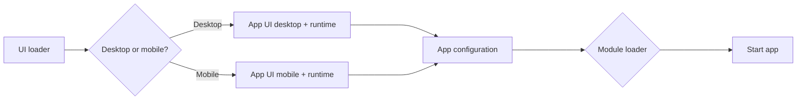

# Ficus App Shell

The Ficus App Shell is a simple, opinionated, and extensible shell for building front-end web applications. It is built on top of [FicusJS](https://www.ficusjs.org).

It is designed to be small, lightweight, and fast. It utilises ES modules to provide a modular approach to building applications and is centered around the concept of micro front-ends.

## Architecture

The app shell is structured around the following front-end architectures:

- [App shell](https://developer.chrome.com/blog/app-shell/)
- [Micro frontends](https://martinfowler.com/articles/micro-frontends.html)
- [Islands architecture](https://www.patterns.dev/posts/islands-architecture/)

An application built with Ficus App Shell is composed of the following:

1. UI loader
2. App UI for desktop and mobile (includes a runtime for modules)
3. Modules

The execution flow is as follows:

## UI loader

The UI loader loads the initial UI for the app. The initial UI is the minimal HTML and CSS required for the app to be presented to the user. The initial UI is typically rendered using placeholders before the app is fully loaded. It is loaded as soon as possible (typically embedded in the `index.html`), and is responsible for loading the rest of the app.

The UI loader loads the App UI based on a configured media query. A single app tag is used to determine the App UI to load. The app tag is a custom HTML element that determines the App UI to load based on a configured screen width media query. The app tag is typically placed in the `index.html` file.

> The package [`@ficusjs/app-shell-ui-loader`](packages/ui-loader/) provides the functions for implementing the UI loader.

## App UI for desktop and mobile

The app UI is responsible for rendering the structure of the application (headers, navigation, footer, router outlet etc.) and loading the runtime.

The app UI can be whatever you want it to be. You provide separate desktop and mobile UI ES modules.

### Runtime for modules

The runtime for modules is a set of helpers made available to the modules. The app shell runtime is loaded by the app UI; desktop or mobile. It is responsible for loading the app configuration, loading modules and providing helpers to the modules.

The runtime includes the following features:

- App configuration
- Module loader
- Routing
- State management
- Pub/sub event bus
- Internationalisation

Modules can use the helpers provided by the runtime to implement their features. These include:

- Loading modules
- Creating web components
- Creating application state
- Creating application events
- Creating finite state machines
- Registering routes
- Loading internationalisation messages

> The package [`@ficusjs/app-shell-runtime`](packages/runtime/) provides the functions for loading the runtime.

## Modules

Modules are the features of the application. They are loaded by the runtime and can use the features provided by the runtime to implement their features.

Modules are lazily loaded by the runtime and are registered with the runtime. They are loaded when they are needed by the application. This allows the application to load only the modules that are needed by the user.

Modules only contain the structure required for registration. The runtime provides the features to the modules for registering components, routes, state or whatever the module needs. As modules only contain the structure required for registration, they are small and lightweight.

Modules can be loaded from a CDN or from the server.

## App configuration

The app configuration is a JSON file (or API) that contains the configuration for the application. It is loaded by the runtime and is used to configure the application.

App configuration includes:

- Available modules
- Start path

### Available modules

The available modules are the modules that are available to the application. They are loaded by the runtime and are used by the application.

Each module is registered with the runtime and is loaded when needed by the application. The configuration for each module includes:

- ID
- Module loader (the module entry point)
- Version
- Start path
- Routes
- Layouts

### Start path

The start path is the path that the application starts on. It is used by the runtime to load the correct module.

## Examples

The following examples are available:

- [Plant store application](examples/apps/plant-store/)
- [Plant store modules](examples/modules/plant-store/)

### Plant store

The plant store is a simple plant store application. It is a good example of how to build an application with Ficus App Shell.

To view the plant store application in action, visit the [live demo](https://ficus-app-shell-plant-store.surge.sh/).

## License

This project is licensed under the MIT License - see the [`LICENSE`](LICENSE) file for details.

## Contributing to Ficus App Shell

Any kind of positive contribution is welcome! Please help us to grow by contributing to the project.

If you wish to contribute, you can work on any features you think would enhance the library. After adding your code, please send us a Pull Request.

> Please read [CONTRIBUTING](CONTRIBUTING.md) for details on our [CODE OF CONDUCT](CODE_OF_CONDUCT.md), and the process for submitting pull requests to us.

## Support

We all need support and motivation. FicusJS is not an exception. Please give this project a ⭐️ to encourage and show that you liked it. Don't forget to leave a star ⭐️ before you move away.

If you found the library helpful, please consider [sponsoring us](https://github.com/sponsors/ficusjs).
